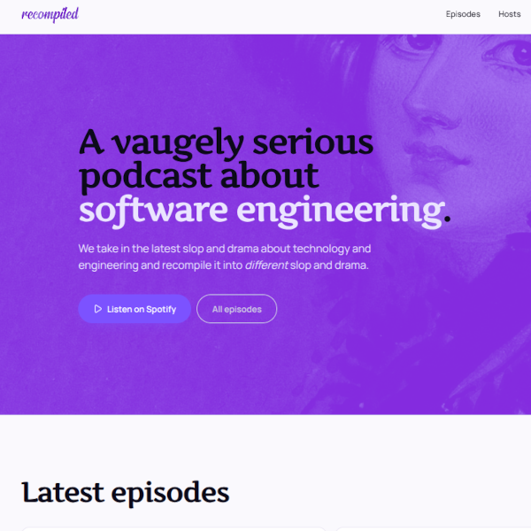
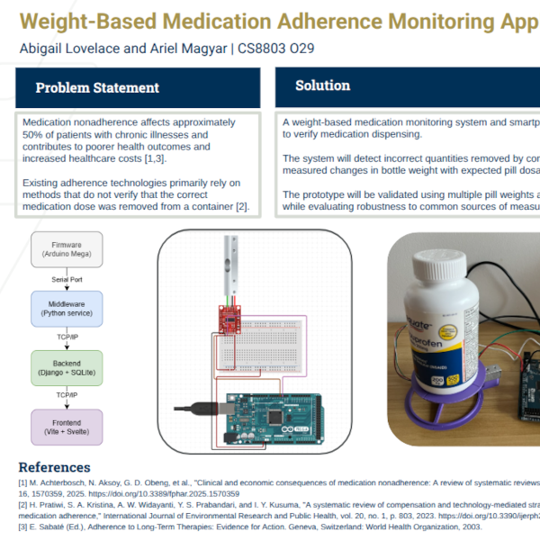
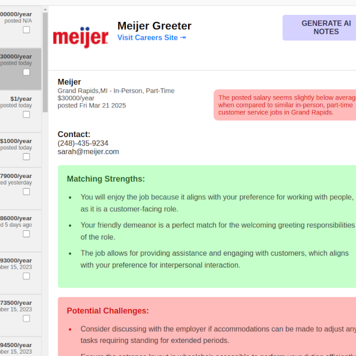

<h1 align="center">Ariel Magyar</h1>

<strong>Land-ho! You've stumbed across my project chest.</strong>

				

<strong>Let's see what treasures can be found here...</strong>

## Projects

<table>
	<tr>
		<td width="33%" valign="top">
			<h3 align="center"><a href="https://github.com/magyara/recompiled-podcast">Recompiled Podcast</a></h3>
			

				
			

			
<strong>Recompiled Podcast</strong> is a companion website for the podcast I co-host with my friend Abi. It parses our podcast's RSS feed to display the latest episodes.

			

				
				
				
				
				
			

		</td>
		<td width="33%" valign="top">
			<h3 align="center"><a href="https://github.com/ParisPianist196/mediscale">MediScale</a></h3>
			

				
			

			
<strong>MediScale</strong> is a project I worked on for my Computer Science graduate program at the Georgia Institute of Technology. It is a web application that interfaces with a physical scale. By weighing medication bottles, it is able to track if medication has been taken thoughout the day. This is aimed at helping prevent medication nonadherence, which affects approximately 50% of patients with chronic illnesses globally.

			

				
				
				
				
				
				
				
			

		</td>
		<td width="33%" valign="top">
			<h3 align="center"><a href="https://github.com/zachpatrignani/microsoft-hackathon">Interstellar Jobs</a></h3>
			

				
			

			
<strong>Interstellar Jobs</strong>  is a prototype job board that uses AI-powered recommendations to help people with disabilities or impairments find accessible employment opportunities. It was built in just 11 days and took first place in the Microsoft Innovation Challenge Hackathon.

			

				
				
				
				
			

		</td>
	</tr>
</table>
